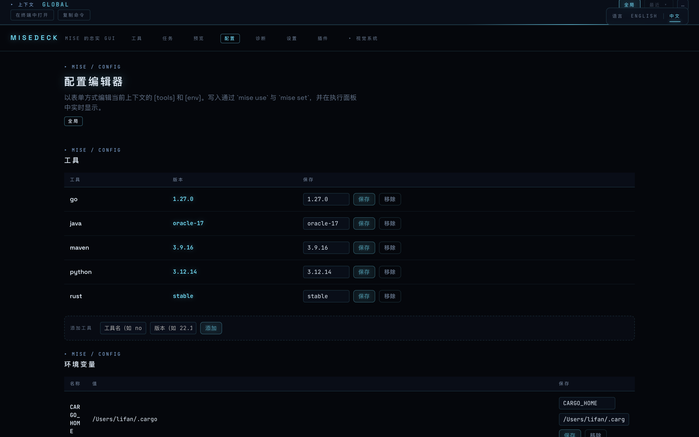
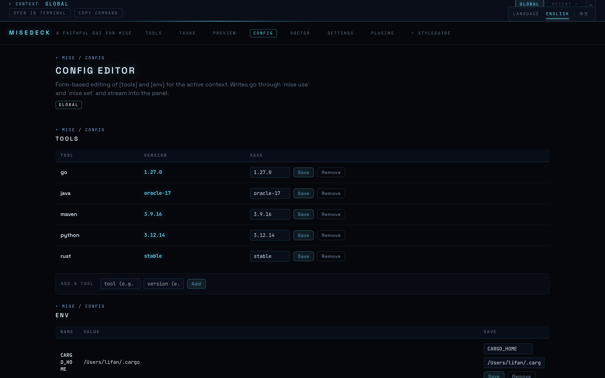

# MiseDeck

> [简体中文](./zh-CN/README.md)

**A desktop GUI for [mise](https://mise.jdx.dev), the polyglot tool version manager.** Faithful to the command line you already know: every screen maps to a mise command, and every action shows you the exact command it runs.

## Why

- **See everything**: installed tools, active versions, outdated upgrades, per-directory overrides with their config source — no mental PATH math.
- **Act safely**: every mutation shows the exact `mise` command and its live logs. Nothing happens in a black box.
- **Learn as you go**: the GUI teaches the CLI instead of hiding it.
- **Per-directory without the terminal**: point the app at a directory and see (and edit) what mise would resolve there.

## Features (v1)

- **Global tool management**: install, uninstall, switch, upgrade, and see outdated badges in one table.
- **Directory context**: resolved tools, env vars, and lockfile for any directory, with config-source badges.
- **Config editing**: form-based `[tools]` and `[env]` editing for global and per-directory `mise.toml`.
- **Tasks**: list, run with live output, and simple edits.
- **Trust UX**: untrusted directories stay read-only until you choose to trust them.
- **Settings, doctor, and plugin/backend browsing**: inspect and tweak settings, run `mise doctor`, and browse the registry.
- **mise self-management**: guided install when mise is missing and one-click self-update.
- **Activation helpers**: open the current directory in a terminal, copy the activation command, and check shell setup.
- **English and Simplified Chinese UI**.

## Screenshots

| English | 简体中文 |
| --- | --- |
|  |  |
|  |  |
|  |  |
|  |  |

More screenshots, including the i18n switcher, execution panel, and visual-system gallery, are in [`docs/screenshots/`](./docs/screenshots/).

## Install

Pre-built unsigned binaries are available on [GitHub Releases](https://github.com/cherishfall/misedeck/releases).

```bash
# macOS (recommended)
brew install --cask cherishfall/tap/misedeck
```

macOS builds are not signed. On first open, right-click the app and choose **Open** instead of double-clicking, then confirm in the Gatekeeper dialog. You can also remove the quarantine attribute from Terminal:

```bash
xattr -dr com.apple.quarantine /Applications/MiseDeck.app
```

Windows `.exe`/`.msi` and Linux `.deb`/`.rpm`/`.AppImage` beta builds are produced by CI and attached to each release.

## For contributors

Agent-friendly by design: start at [AGENTS.md](./AGENTS.md), the glossary in [CONTEXT.md](./CONTEXT.md), and decisions in [docs/adr/](./docs/adr/).

## Disclaimer

MiseDeck is a community project, not affiliated with or endorsed by the official mise project.

## License

[MIT](./LICENSE)
