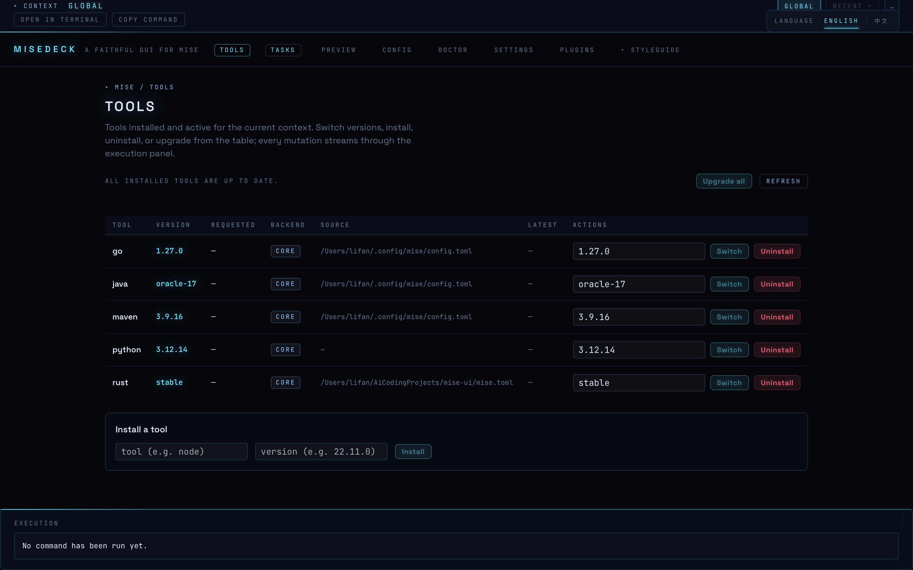
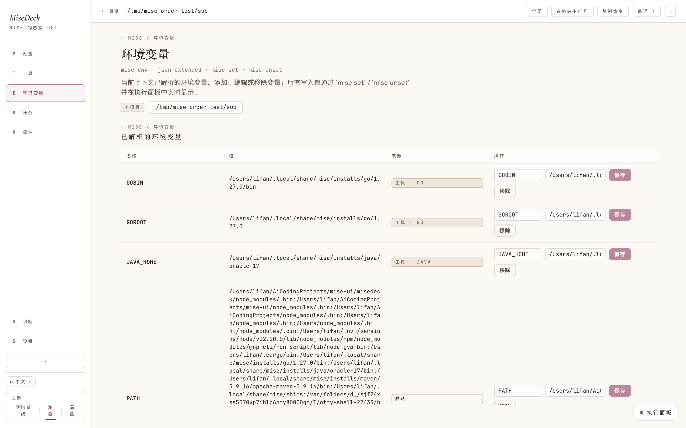
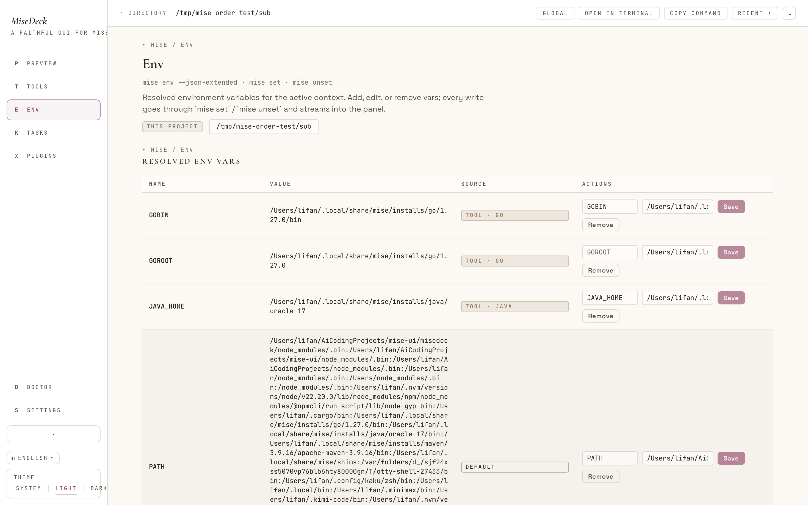
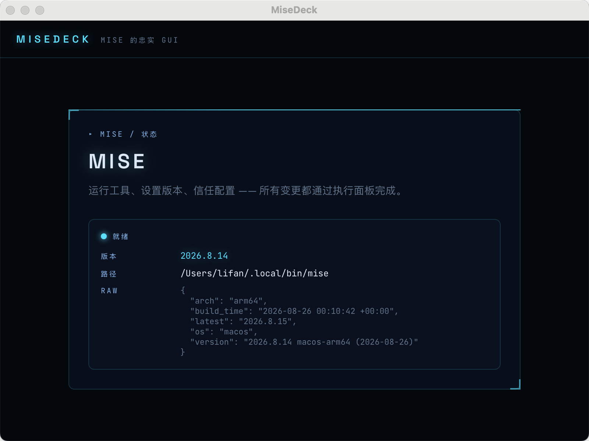
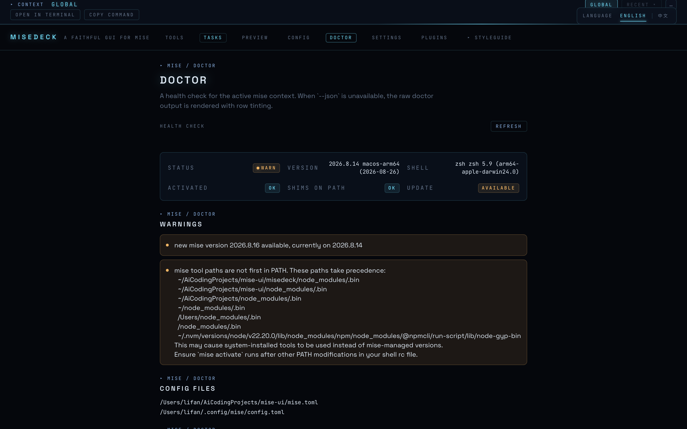
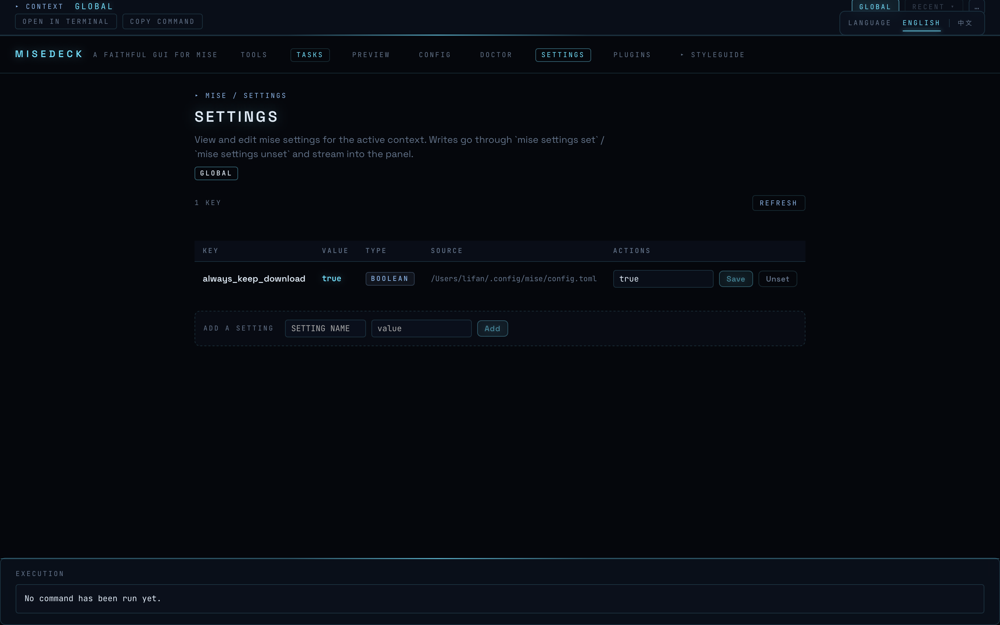

# MiseDeck

> [English](../README.md)

**[mise](https://mise.jdx.dev)（多语言工具版本管理器）的桌面 GUI。** 忠实于你已知的命令行：每个界面都对应一条 mise 命令，每个操作都向你展示它实际执行的命令。

## 为什么

- **一目了然**：已装工具、生效版本、可升级项、按目录的覆盖及其配置来源——不再用脑算 PATH。
- **安全操作**：每个变更都展示真实的 `mise` 命令和实时日志，没有黑箱。
- **边用边学**：GUI 教你 CLI，而不是把它藏起来。
- **目录级配置，无需终端**：把应用指向一个目录，就能看到（并编辑）mise 在该目录下解析出的结果。

## 功能（v1）

- **全局工具管理**：在一个表格中安装、卸载、切换、升级，并查看过时提醒。
- **目录上下文**：任意目录的解析工具、环境变量与 lockfile，并标注配置来源。
- **环境变量**：按目录或全局进行一等环境变量管理（`mise env` / `mise set` / `mise unset`），配置文件可见性在预览页。
- **任务**：列表、实时输出运行、简单编辑。
- **信任机制**：未信任目录默认只读，由你决定是否信任。
- **设置、doctor 诊断、插件/后端浏览**：查看与调整设置、运行 `mise doctor`、浏览 registry。
- **mise 自管理**：未检测到 mise 时引导安装，一键自我更新。
- **激活辅助**：在当前目录打开终端、复制激活命令、检查 shell 配置。
- **中英文双语界面**。

## 截图

| English | 简体中文 |
| --- | --- |
|  |  |
|  |  |
|  |  |
|  |  |

更多截图，包括语言切换器、执行面板与视觉系统图鉴，见 [`docs/screenshots/`](../docs/screenshots/)。

## 安装

未签名的预构建二进制文件可在 [GitHub Releases](https://github.com/cherishfall/misedeck/releases) 下载。

```bash
# macOS（推荐）
brew install --cask cherishfall/tap/misedeck
```

macOS 构建未签名、未公证。首次打开时，Gatekeeper 可能提示应用来自未认证开发者；把应用从 DMG 拖到`/应用程序`后，也可能弹出 **“misedeck”已损坏，无法打开**。这是 macOS 对未签名应用的隔离（quarantine）标记导致的。

请在`/应用程序`里的应用副本上移除隔离属性：

```bash
xattr -dr com.apple.quarantine /Applications/misedeck.app
```

然后正常打开即可。也可以尝试在 **系统设置 → 隐私与安全性 → 安全性** 中点击**仍要打开**。

Windows 的 `.exe`/`.msi` 与 Linux 的 `.deb`/`.rpm`/`.AppImage` beta 构建由 CI 生成并附加到每个 release。

## 参与贡献

本项目对 AI agent 友好：从 [AGENTS.md](../AGENTS.md)、术语表 [CONTEXT.md](../CONTEXT.md)、决策记录 [docs/adr/](../docs/adr/) 开始。

## 免责声明

MiseDeck 是社区项目，与 mise 官方项目无隶属或背书关系。

## 许可证

[MIT](../LICENSE)
